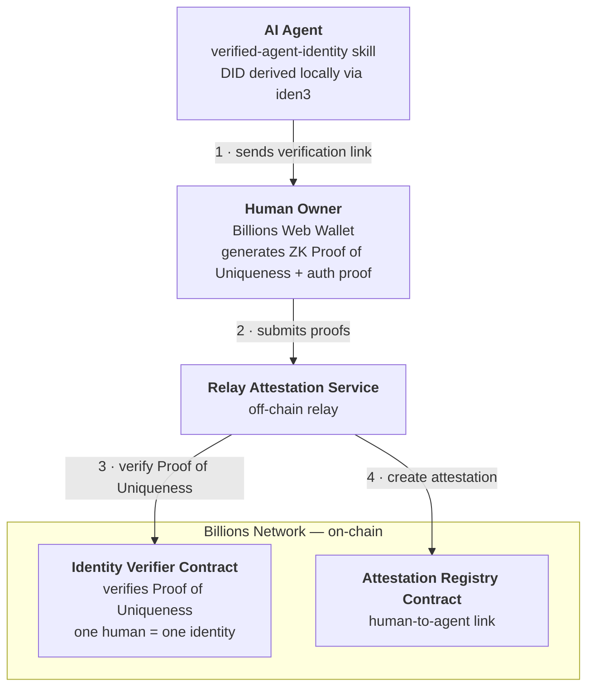

## The Linking Flow

<Steps>
  <Step title="Agent creates its DID">
    The agent generates its own DID locally using the [iden3 protocol](https://docs.iden3.io), an open-source ZK identity framework that derives cryptographic identifiers from key pairs. Nothing goes on-chain at this point.
  </Step>
  <Step title="Agent shares a verification link">
    When asked to link its identity, the agent signs a pairing request with its own key and builds a verification link scoped to this specific human-agent pairing, then shares it with the human owner.
  </Step>
  <Step title="Human verifies ownership in the Billions Web Wallet">
    The human opens the link in the Billions Web Wallet. If they haven't already claimed a [Proof of Uniqueness credential](/billions-wallet/proof-of-uniqueness), the claim process (a one-time face scan) starts automatically; if they have, it's reused. Either way, the wallet generates a zero-knowledge Proof of Uniqueness and an auth proof for the human, and submits them to the Relay Attestation Service. The auth proof is tied to this agent's DID, so it can't be reused for a different agent.
  </Step>
  <Step title="Attestation created on-chain">
    The Relay makes two on-chain calls on the Billions Network. First, the **Identity Verifier Contract** verifies the ZK proof and stores it against the user's DID, enforcing PoU's one-human-one-identity guarantee. Then, the **Attestation Registry Contract** creates an on-chain attestation linking the verified human to the agent's DID.
  </Step>
</Steps>

The resulting attestation is on-chain, and any third party can query it to confirm that the pairing exists. Confirming that a caller controls the agent DID is a separate check: see [Verify an Agent](/agents/verify-human-agent-pairing).

---

## Architecture

Five components carry the flow from a locally generated key pair to a public on-chain attestation:

Reading the diagram in flow order:

1. **Verified Agent Identity skill**: runs on the agent. It derives the agent's DID from a local key pair and orchestrates the linking flow, starting by sending the human owner a verification link.
2. **Billions Web Wallet**: where the human proves who they are. It generates a zero-knowledge **Proof of Uniqueness** (proving the human is real and unique without revealing personal data) plus an auth proof, and submits both.
3. **Relay Attestation Service**: the off-chain bridge. It receives the proofs and turns them into two on-chain transactions.
4. **Identity Verifier Contract**: verifies the ZK proof on-chain and stores it against the human's DID. It's Sybil-resistant by design — one verified human maps to one on-chain identity, so a single person can't register that identity more than once. That person can still pair several agents.
5. **Attestation Registry Contract**: writes the public attestation linking the verified human's identity to the agent's DID.

<iframe
  width="100%"
  height="400"
  src="https://www.youtube.com/embed/OJho4F-UbaI"
  title="Verified Agent Identity — Architecture Walkthrough"
  frameBorder="0"
  allow="accelerometer; autoplay; clipboard-write; encrypted-media; gyroscope; picture-in-picture"
  allowFullScreen
></iframe>

---

## Demo

This demo shows the full flow end to end: an agent going from no identity to an on-chain pairing with its human owner, in a few minutes.

<iframe
  width="100%"
  height="400"
  src="https://www.youtube.com/embed/0K3HPKBLEak"
  title="Verified Agent Identity — Live Demo"
  frameBorder="0"
  allow="accelerometer; autoplay; clipboard-write; encrypted-media; gyroscope; picture-in-picture"
  allowFullScreen
></iframe>

The demo uses **Billy**, an agentic bot on Telegram, built with the [OpenClaw](https://openclaw.ai) framework for building and deploying AI agents. The demo follows Billy through exactly the flow described in [The Linking Flow](#the-linking-flow) above. A few details worth watching for:

- Installation takes a single chat message.
- The face scan happens only once: first-time users claim a Proof of Uniqueness credential in the Billions Web Wallet with a one-time scan, then the same credential is reused for every future verification.
- The result is checkable end to end. Billy appears under **Verified Agents** in the user's wallet profile, and the last four characters of his DID (`V9HT`) match what he shared in the Telegram chat.

---

## Under the Hood

The skill handles the agent-side steps; the human opens the wallet link and approves the pairing. The sections below document exactly what the skill does on disk and on-chain, for when you need the details.

<AccordionGroup>
  <Accordion title="How the skill runs">
    When installed, the skill adds a `scripts/` directory to the agent's workspace and runs `npm install` to set up dependencies.

    All cryptographic material is stored in `$HOME/.openclaw/billions/` (OpenClaw's data directory), outside the agent's workspace, so identity data persists across sessions and agent restarts. The agent reads this directory on startup to load its default DID and private keys.

    When the agent receives a natural-language trigger (e.g. "link your identity to me"), the skill's instruction set maps it to the appropriate script, executes it as a subprocess, and returns the result to the conversation.
  </Accordion>
  <Accordion title="Pairing and attestation flow (tech spec)">
    The sequence starts on the agent, before the link is shared, and ends on-chain:

    1. **Agent's signed token**: before the link is shared, the agent signs a JWS with its own private key. The token is embedded in the link's callback URL. The wallet never holds the agent's key; it only passes the token along.
    2. **Proof of Uniqueness**: the wallet generates a ZK proof that the human is a real, unique individual, without revealing personal data.
    3. **Human auth proof**: the wallet also generates an auth proof for the human, with a challenge derived from the attestation details, including the agent's DID. This ties the human's proof to this specific agent.
    4. The wallet submits the proofs to the **Relay Attestation Service**, with the agent's signed token from the callback URL.
    5. The Relay calls the **Identity Verifier Contract** on the Billions Network, which verifies the ZK proof on-chain and stores it against the user's DID — the same one-human-one-identity guarantee described above.
    6. The Relay calls the **Attestation Registry Contract**. An on-chain attestation is written linking the verified human's DID to the agent's DID.

    The attestation is public, and any third party can query it. A query shows that the pairing exists. It does not show that the caller controls the agent's DID, so check that separately.
  </Accordion>
</AccordionGroup>

---

## Next Steps

<CardGroup cols={2}>
  <Card title="Pair an Agent" icon="link" href="/agents/identity-skill">
    Install the skill and pair your agent with you in two chat messages.
  </Card>
  <Card title="Verify an Agent" icon="user-shield" href="/agents/verify-human-agent-pairing">
    Check that a caller controls an agent DID, then check whether a verified human is paired with it.
  </Card>
</CardGroup>
