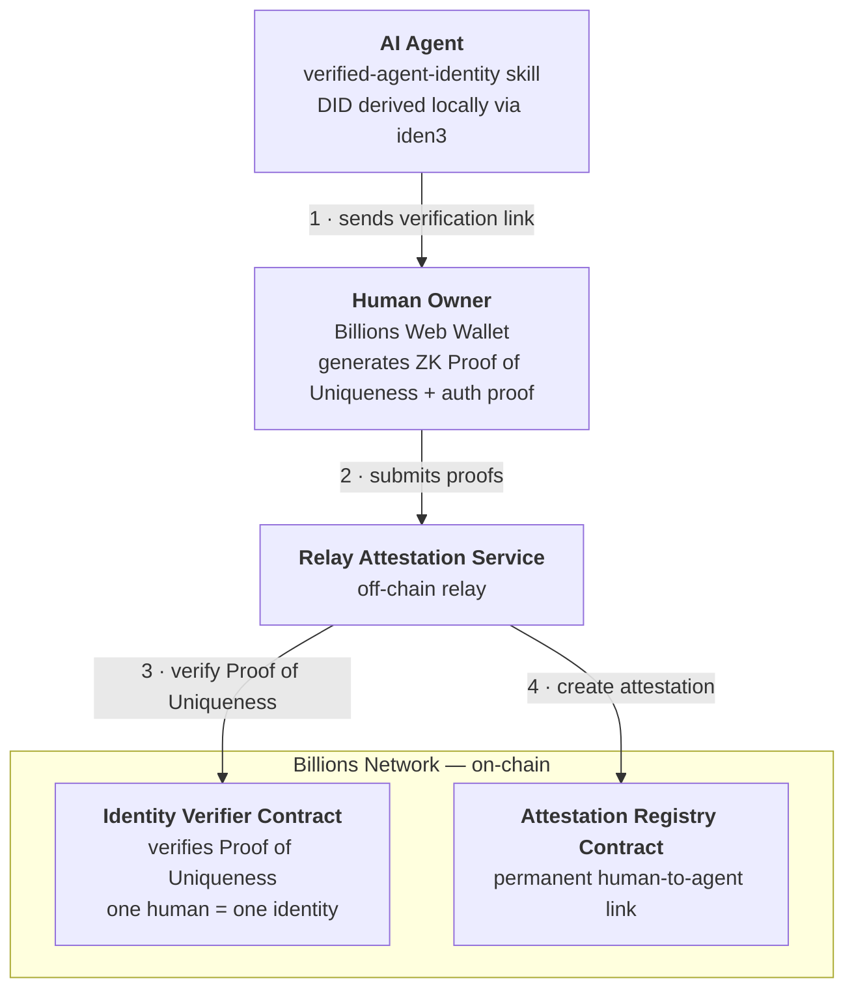

Every AI agent today runs without a real identity — just code executing somewhere, with no way to prove who owns it or hold anyone accountable. The **Verified Agent Identity** skill fixes that: it gives any AI agent a decentralized identifier (DID) on the Billions Network and links it permanently and verifiably, on-chain — to a real human owner.

Once linked, the agent can prove it is operated by a real, unique human. Service providers get spam protection, and anyone can look up a public, tamper-proof record of who stands behind the agent.

<Card title="GitHub" icon="github" href="https://github.com/BillionsNetwork/verified-agent-identity">
  BillionsNetwork/verified-agent-identity
</Card>

## Features

<CardGroup cols={2}>
  <Card title="Identity Creation" icon="circle-plus">
    Give your agent its own DID — derived locally from a cryptographic key pair, no registry or sign-up required.
  </Card>
  <Card title="Identity Management" icon="list">
    List and manage multiple identities with default identity support.
  </Card>
  <Card title="Human-Agent Linking" icon="link">
    Link a human identity to an agent's DID through signed challenges.
  </Card>
  <Card title="x402 Discounted Pricing" icon="tag" href="/agents/overview">
    Human-owned agents unlock discounted pricing tiers on APIs protected by x402 Human Proof.
  </Card>
</CardGroup>

---

## How It Works

<Steps>
  <Step title="Agent creates its DID">
    The agent generates its own DID locally using the [iden3 protocol](https://docs.iden3.io) — an open-source ZK identity framework that derives cryptographic identifiers from key pairs. Nothing goes on-chain at this point.
  </Step>
  <Step title="Agent shares a verification link">
    When asked to link its identity, the agent generates a verification link scoped to this specific human-agent pairing and shares it with the human owner.
  </Step>
  <Step title="Human verifies ownership in the Billions Web Wallet">
    The human opens the link in the Billions Web Wallet, generates a zero-knowledge Proof of Uniqueness and an auth proof, and submits them to the Relay Attestation Service.
  </Step>
  <Step title="Permanent attestation created on-chain">
    The Relay makes two on-chain calls on the Billions Network. First, the **Identity Verifier Contract** verifies the ZK proof and stores it against the user's DID — enforcing that one verified human maps to exactly one on-chain identity. Then, the **Attestation Registry Contract** creates a permanent on-chain attestation linking the verified human to the agent's DID.
  </Step>
</Steps>

The resulting attestation is permanent, public, and queryable by any third party to confirm agent ownership.

---

## Architecture

Five components carry the flow from a locally generated key pair to a public on-chain attestation:

Reading the diagram in flow order:

1. **Verified Agent Identity skill** — runs on the agent. It derives the agent's DID from a local key pair and orchestrates the linking flow, starting by sending the human owner a verification link.
2. **Billions Web Wallet** — where the human proves who they are. It generates a zero-knowledge **Proof of Uniqueness** (proving the human is real and unique without revealing personal data) plus an auth proof, and submits both.
3. **Relay Attestation Service** — the off-chain bridge. It receives the proofs and turns them into two on-chain transactions.
4. **Identity Verifier Contract** — verifies the ZK proof on-chain and stores it against the human's DID. It is Sybil-resistant by design: one verified human maps to exactly one on-chain identity.
5. **Attestation Registry Contract** — writes the permanent, public attestation linking the verified human's identity to the agent's DID.

---

## Demo

Watch the whole flow happen live: in a few minutes, an agent goes from having no identity at all to a permanent, publicly verifiable on-chain pairing with its human owner.

<iframe
  width="100%"
  height="400"
  src="https://www.youtube.com/embed/0K3HPKBLEak"
  title="Verified Agent Identity — Live Demo"
  frameBorder="0"
  allow="accelerometer; autoplay; clipboard-write; encrypted-media; gyroscope; picture-in-picture"
  allowFullScreen
></iframe>

The demo uses **Billy**, an agentic bot on Telegram, built with the [OpenClaw](https://openclaw.ai) framework for building and deploying AI agents. The demo follows Billy through exactly the flow described in [How It Works](#how-it-works) above. A few details worth watching for:

- **Installation is a single chat message.** Pasting `` Install the skill `npx clawhub@latest install verified-agent-identity` `` into the conversation is all it takes — [Clawhub](https://clawhub.ai), the skill manager for OpenClaw-compatible agents, handles the setup with no manual configuration.
- **The face scan happens once.** First-time users claim a Proof of Uniqueness credential in the Billions Web Wallet with a one-time face scan. The credential is stored in the wallet and reused for every future verification.
- **The result is checkable end to end.** After verification, Billy appears under **Verified Agents** in the user's wallet profile — and the last four characters of his DID (`V9HT`) match exactly what he shared in the Telegram chat.

---

## Next Steps

<Card title="Installation" icon="download" href="/agents/identity-skill">
  Install the skill and link your agent's identity to you in two chat messages.
</Card>
