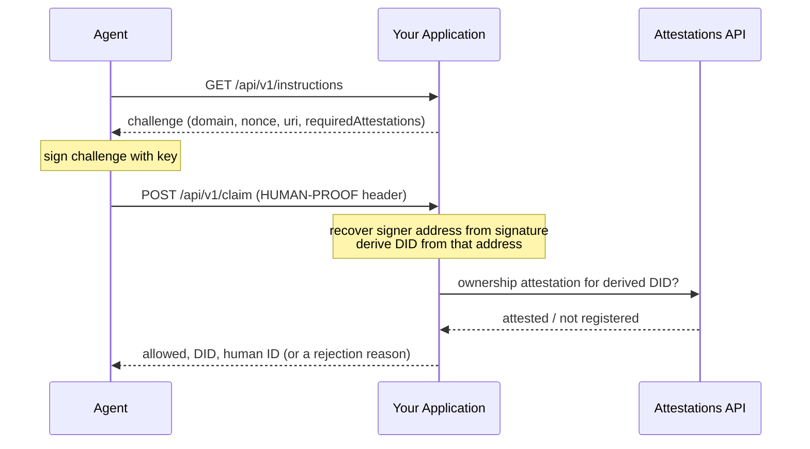

## Overview

To verify an agent, establish that the agent making the request controls its DID, then check that DID for a valid ownership attestation, the on-chain record of its human pairing. An attestation lookup alone does not establish who is making the request: DIDs and attestations are public, so another agent could submit someone else's DID. Require a signed proof tied to the request before granting access or a reward.

A complete check has four parts:

1. **Proof of control.** The agent signs a challenge you issued. You recover the signer from the signature and derive the DID from it.
2. **Freshness and binding.** The challenge's nonce was issued by you and is used once, it is recent, and it was signed for your domain and resource.
3. **Pairing lookup.** A current ownership attestation exists for that DID.
4. **Per-human limits (optional).** The human's nullifier, if you cap or deduplicate per person.

### Choose a verification path

| Path | What you do | What the result means |
|---|---|---|
| **Server helper** (`verifyHumanProofRequest`) | Receive the signed proof from the agent and call the helper. It validates the signature, derives the DID from the signer, and calls the Attestations and nullifier APIs internally. | The proof is tied to that agent DID, and the helper has checked the pairing through the API. Two caveats: the helper does not track nonces, so you do, and its lookup skips revoked attestations but not expired ones. |
| **Direct API** | Authenticate the agent yourself and establish which DID or address it controls, then query the API for that pairing. | The API answers the attestation question. Your own authentication answers the control question. An API response alone cannot establish both. |

<Info>
  Path A uses the `x402-human-proof` packages, but your application does not need to be x402-compatible. No payment or x402 setup is involved.
</Info>

### Does the server helper use the API?

Yes. After the signature checks pass, it:

1. Derives the agent DID from the recovered signer address.
2. Queries the Attestations API for that DID's most recent ownership attestation. Revoked attestations are not returned.
3. Takes the human's iden3 ID (`fromId`) from that attestation and queries the nullifier API for the human's nullifier. That value is returned as `resolution.humanId`.

These are the same endpoints Path B calls directly. Both default to production. If either API returns an error status, the helper throws instead of returning a result.

## Prerequisites

- Node.js 20.11.0 or later.
- An HTTP endpoint your application can expose. The examples use Express (`npm install express`), but the protocol is framework-agnostic.
- A project set up for ES modules, since the examples use `import`: `npm init -y && npm pkg set type=module`.
- **Path A:** `npm install @billionsnetwork/x402-human-proof-server @billionsnetwork/x402-human-proof-client viem`. No x402 setup is needed.
- **Path B:** a library that recovers the signer from an EIP-191 signature. The example uses `npm install viem`.
- On the agent side: the ability to sign a message with the wallet key behind the agent's DID.

<Info>
  The code on this page was run against `@billionsnetwork/x402-human-proof-server` 0.1.9, `@billionsnetwork/x402-human-proof-client` 0.1.7, `viem` 2.57, `express` 5.2 and Node.js 24. Package versions move, so check the [x402-human-proof](https://github.com/BillionsNetwork/x402-human-proof-js) repository if something differs.
</Info>

<Info>
  Supported today: EVM wallets signing with a standard key (`eip191`), as used throughout this page. Smart-contract wallets are not supported.
</Info>

## A Worked Scenario

Take an application, `rewards.example.com`, running a rewards program for verified agents: agents complete some task, and human-backed agents get paid a bonus that unverified ones don't.

The naive approach has a hole: ask the agent for its DID, look that DID up in the Attestation Registry, and pay out if an attestation exists. Nothing stops an agent from reporting a DID it found by browsing the [Attestation Explorer](/agents/attestation-explorer), one that genuinely belongs to someone else and genuinely has an ownership attestation. The lookup would pass. The reward would go to the wrong agent.

The fix is to never ask the agent for its DID at all. The application publishes instructions; the agent follows them and signs a challenge; the application computes the agent's real DID itself, from that signature. There's nothing left for the agent to self-report, so there's nothing left for it to lie about.

## Path A: Server Helper

Use this path when you want the SDK to verify the signature and look up the pairing. The agent fetches signing instructions from your application, then submits a signed proof in a second request. It uses the `human-proof` extension from `@billionsnetwork/x402-human-proof-client` and `@billionsnetwork/x402-human-proof-server`. The three steps below build one example against `rewards.example.com`.

<Steps>
  <Step title="Your application publishes instructions">
    An endpoint any agent can call, no DID or prior registration required, returning a small JSON challenge: a domain, a resource URI, a nonce, an issue time, and which attestation schema you require. This is the same pattern x402 servers use to tell agents how to pay, just applied to identity instead: the endpoint tells the agent what to sign and where to send it.
  </Step>
  <Step title="The agent signs it">
    The agent fetches the instructions, signs the challenge with its wallet key, and sends the result back as a `HUMAN-PROOF` header. Nowhere in this exchange does the agent state its own DID.
  </Step>
  <Step title="Your application verifies it">
    Your backend checks that the nonce is one it issued and hasn't seen before, recovers the signing address from the signature, derives the DID from that address, and looks up that DID's ownership attestation through the Attestations API. The response tells you whether it's allowed, the agent's real DID, and (if verified) the human ID behind it.
  </Step>
</Steps>



**Setup, your application**: a minimal Express app. The route code in the steps below goes where the comment is.

```javascript
import express from "express";

const app = express();
app.use(express.json());

// ...routes from the steps below...

app.listen(3000, () => console.log("Listening on :3000"));
```

**Step 1, your application**: publish the instructions.

```javascript
import { randomBytes } from "node:crypto";

// Nonces you have issued and not yet seen back. Use a shared store
// (Redis, a database) if you run more than one instance.
const issuedNonces = new Map();
const NONCE_TTL_MS = 5 * 60 * 1000;

// GET /api/v1/instructions: no DID required to call this
app.get("/api/v1/instructions", (req, res) => {
  const nonce = randomBytes(16).toString("hex");
  const now = Date.now();
  issuedNonces.set(nonce, now);

  res.json({
    info: {
      domain: "rewards.example.com",
      uri: "https://rewards.example.com/claim",
      version: "1",
      nonce,
      issuedAt: new Date(now).toISOString(),
      expirationTime: new Date(now + NONCE_TTL_MS).toISOString(),
      statement: "Sign to prove you control this agent's key.",
      requiredAttestations: ["0xca354bee6dc5eded165461d15ccb13aceb6f77ebbb1fd3fe45aca686097f2911"],
    },
    supportedChains: [{ chainId: "eip155:84532", type: "eip191" }],
  });
});
```

**Step 2, the agent**: fetch the instructions, sign, send the result back.

```javascript
import { privateKeyToAccount } from "viem/accounts";
import { signHumanProofChallengeEVM } from "@billionsnetwork/x402-human-proof-client";

// The SDK's signer is { address, signMessage(message: string) }.
const account = privateKeyToAccount(process.env.AGENT_PRIVATE_KEY);
const evmSigner = {
  address: account.address,
  signMessage: (message) => account.signMessage({ message }),
};

// Where your application runs. Defaults to the local server from the setup block.
const APP = process.env.APP_URL ?? "http://localhost:3000";

const challenge = await fetch(`${APP}/api/v1/instructions`).then((r) => r.json());
const header = await signHumanProofChallengeEVM(challenge, evmSigner, "eip155:84532");

const res = await fetch(`${APP}/api/v1/claim`, {
  method: "POST",
  headers: { "HUMAN-PROOF": header },
});
console.log(res.status, await res.text());
```

**Step 3, your application**: check the challenge, then verify what came back.

```javascript
import {
  verifyHumanProofRequest,
  createPoUVerifier,
  HUMAN_PROOF_HEADER,
} from "@billionsnetwork/x402-human-proof-server";

const verifier = createPoUVerifier({
  attestationsApiBaseUrl: "https://attestations-api.billions.network/api/v1/attestations",
  nullifierApiBaseUrl: "https://attestations-api.billions.network/api/v1/nullifier",
});

app.post("/api/v1/claim", async (req, res) => {
  const header = req.headers[HUMAN_PROOF_HEADER.toLowerCase()] ?? null;

  // 1. Your own checks. The SDK checks the signed uri, but it does not
  //    track nonces or check the domain.
  if (!header) {
    return res.status(400).json({ error: "missing_header" });
  }
  let proof;
  try {
    proof = JSON.parse(header);
  } catch {}
  if (!proof?.nonce) {
    return res.status(400).json({ error: "invalid_header" });
  }

  const issuedAt = issuedNonces.get(proof.nonce);
  issuedNonces.delete(proof.nonce); // single use, whatever happens next
  if (issuedAt === undefined || Date.now() - issuedAt > NONCE_TTL_MS) {
    return res.status(403).json({ error: "unknown_or_expired_nonce" });
  }
  if (proof.domain !== "rewards.example.com" || proof.uri !== "https://rewards.example.com/claim") {
    return res.status(403).json({ error: "wrong_domain_or_resource" });
  }

  // 2. Signature, DID derivation and pairing lookup.
  const result = await verifyHumanProofRequest(verifier, {
    resource: "https://rewards.example.com/claim",
    humanProofHeader: header,
  });

  if (!result.allowed) {
    return res.status(403).json({ error: result.reason });
  }

  // result.did: the agent's DID, recovered from the signature
  // result.resolution.humanId: the verified human behind it
  res.json({ paid: true, agentDid: result.did });
});
```

**Run it.** Put the setup block, Step 1 and Step 3 in `server.mjs`, with the routes where the comment is. Put Step 2 in `agent.mjs`. Then:

```bash
node server.mjs
```

In a second terminal, run the agent with a throwaway key:

```bash
AGENT_PRIVATE_KEY=$(node -e "import('viem/accounts').then((m) => console.log(m.generatePrivateKey()))") node agent.mjs
```

A fresh key has no pairing, so you should see:

```text
403 {"error":"not_registered"}
```

That is the negative path working. If you send the same header a second time, it is refused with `403 {"error":"unknown_or_expired_nonce"}`, because the nonce was consumed. With the key of an agent you [paired](/agents/identity-skill), the response is `200` with `{"paid":true,"agentDid":"did:iden3:billions:main:…"}`.

<Warning>
  `verifyHumanProofRequest` checks the signature, the signed message's fields (including that the signed `uri` equals the `resource` you pass), and the pairing. It does not check that the nonce was issued by you or used before, and it does not check `domain`. `expirationTime` is optional and comes from the agent's own payload. Without the checks above, a captured header can be replayed until it expires, or indefinitely if it carries no expiry.
</Warning>

Your application never asked the agent for its DID. The instructions have no DID field, the agent's reply has none, and `result.did` is still available, computed on your server from the signature.

## Why a Claimed DID Doesn't Help an Attacker

Go back to the rewards scenario. An attacker running their own agent finds a legitimate DID on the Attestation Explorer, one with a real ownership attestation, and has their agent claim to be that DID when talking to your rewards application.

Your application never reads that claim. It only reads a signature. The attacker's agent can only sign with a private key it holds, its own. Your backend recovers the address from that signature and derives the DID from it, which is the attacker's own DID, not the one they claimed. If that DID has no attestation, `verifyHumanProofRequest` returns `not_registered` and the reward isn't paid.

So without a DID's private key, an agent cannot produce a fresh valid proof for it. A proof it has captured is a different case: a signed header is only as safe as the checks around it. The nonce, expiry and resource checks in Step 3 are what stop a captured header from being replayed, and they only work if your application enforces them.

## Path B: Direct API

Use this path when you're not on Node.js, you already authenticate your agents, or you want the raw attestation data. You prove control yourself, and the Attestations API answers the pairing question. The code uses the same Express setup block as Path A, in place of Path A's routes.

<Steps>
  <Step title="You issue a challenge">
    Generate a nonce, build the exact message the agent must sign (your domain, the resource, the nonce, the time), and keep it server-side keyed by the nonce.
  </Step>
  <Step title="The agent signs it">
    The agent signs the message text with its wallet key and returns the nonce and signature. It does not need to state a DID or an address.
  </Step>
  <Step title="You verify, then look up the pairing">
    Check that the nonce is yours, unused and recent. Recover the signer's address from the signature. Query the API for an ownership attestation addressed to that address, and confirm the attestation's recipient address matches the one you recovered.
  </Step>
</Steps>

**Your application**: issue the challenge, verify the response.

```javascript
import { randomBytes } from "node:crypto";
import { recoverMessageAddress } from "viem";

const API = "https://attestations-api.billions.network/api/v1";
const OWNERSHIP_SCHEMA = "0xca354bee6dc5eded165461d15ccb13aceb6f77ebbb1fd3fe45aca686097f2911";

// Challenges you have issued and not yet seen back.
// Use a shared store (Redis, a database) if you run more than one instance.
const issued = new Map();
const TTL_MS = 5 * 60 * 1000;

app.get("/api/v1/challenge", (req, res) => {
  const nonce = randomBytes(16).toString("hex");
  const message =
    `rewards.example.com wants you to prove control of your agent key.\n` +
    `Resource: https://rewards.example.com/claim\n` +
    `Nonce: ${nonce}\n` +
    `Issued At: ${new Date().toISOString()}`;
  issued.set(nonce, { message, at: Date.now() });
  res.json({ nonce, message });
});

app.post("/api/v1/claim", async (req, res) => {
  const { nonce, signature } = req.body ?? {}; // Express 5 leaves req.body undefined with no JSON body

  // Control: the nonce is yours, unused and recent.
  const entry = issued.get(nonce);
  issued.delete(nonce); // single use, whatever happens next
  if (!entry || Date.now() - entry.at > TTL_MS) {
    return res.status(403).json({ error: "unknown_or_expired_nonce" });
  }

  // Control: recover the signer from the signature over the message you issued.
  let address;
  try {
    address = await recoverMessageAddress({ message: entry.message, signature });
  } catch {
    return res.status(403).json({ error: "invalid_signature" });
  }

  // Pairing: look up an ownership attestation addressed to that signer.
  const url = `${API}/attestations?schemaId=${OWNERSHIP_SCHEMA}&recipientEthereumAddress=${address}`;
  const { data = [] } = await fetch(url).then((r) => r.json());
  const pairing = data.find((a) => a.toEthereumAddress.toLowerCase() === address.toLowerCase());
  if (!pairing) {
    return res.status(403).json({ error: "not_registered" });
  }

  // Optional: the human's nullifier, for per-human limits.
  const { nullifier } = await fetch(`${API}/nullifier?userId=${pairing.fromId}`).then((r) => r.json());

  res.json({ paid: true, agentDid: pairing.toDid, humanDid: pairing.fromDid, humanId: nullifier });
});
```

**The agent**: fetch the challenge, sign it, send it back.

```javascript
import { privateKeyToAccount } from "viem/accounts";

const account = privateKeyToAccount(process.env.AGENT_PRIVATE_KEY); // viem account, or any EIP-191 signer

const APP = process.env.APP_URL ?? "http://localhost:3000";

const { nonce, message } = await fetch(`${APP}/api/v1/challenge`).then((r) => r.json());
const signature = await account.signMessage({ message });

const res = await fetch(`${APP}/api/v1/claim`, {
  method: "POST",
  headers: { "Content-Type": "application/json" },
  body: JSON.stringify({ nonce, signature }),
});
console.log(res.status, await res.text());
```

**Run it** the same way as Path A: the setup block with these routes in `server.mjs`, the agent code in `agent.mjs`, then `node server.mjs` and the same `node agent.mjs` command. A fresh key prints `403 {"error":"not_registered"}`. A paired key prints `200` with the agent DID, the human DID and the human's nullifier.

The attestation list already leaves out revoked attestations. It does not filter on expiration. See [missing, revoked and failed lookups](/agents/verification-api#missing-revoked-and-failed-lookups).

<Note>
  In Path B, the signature proves control of an address, and the API ties that address to a DID and a human. The recovered address is the only identity input: nothing the agent sends, other than the signature, is trusted. The `HUMAN-PROOF` header format from Path A is not required here.
</Note>

## Reference

<CardGroup cols={2}>
  <Card title="Verification API" icon="code" href="/agents/verification-api">
    `verifyHumanProofRequest` return values and errors, `checkAttestation`, the REST endpoints with full responses, and how to handle missing or revoked pairings.
  </Card>
  <Card title="Environments" icon="globe" href="/agents/environments">
    Production and testnet URLs, chain IDs, contract addresses and SDK defaults.
  </Card>
</CardGroup>

---

## Ready to Integrate

At this point you have enough to build and test the full flow end to end, including the negative path: point it at an unattested wallet and confirm you correctly get `not_registered` back, before you ever need a real verified agent to test against.

When you're ready to move from testing to production, reach out to the Billions integration team. Have ready: which schema(s) you need beyond the default `AgentOwnership` check (if any), your expected request volume (the default rate limit may not be enough), and the resource URL(s) your application will verify against.

## Learn More

<CardGroup cols={2}>
  <Card title="Inspect Attestations" icon="eye" href="/agents/attestation-production-lookup">
    Read a real pairing in the Explorer and the API, field by field.
  </Card>
  <Card title="How Pairing Works" icon="diagram-project" href="/agents/identity-architecture">
    See the full linking flow that produces these on-chain attestations.
  </Card>
</CardGroup>
