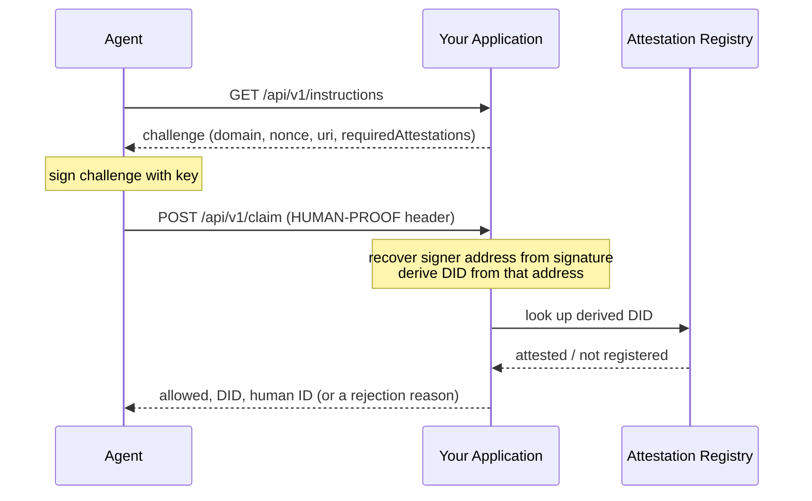

## Overview

An application that wants to treat verified agents differently, paying out a reward, unlocking a discount, granting access, needs an answer to one question it cannot get by just asking the agent: is this agent backed by a real, unique human? An agent can say anything about itself in conversation, including a DID it doesn't actually control. This page covers the protocol that answers the question properly: the agent's DID is never taken on trust, and your application ends up holding proof, not an assertion.

This is a self-contained implementation guide. By the end, you'll have a working, testable integration, and know what to bring to the Billions integration team when you're ready to go live.

## Prerequisites

- Node.js 20.11.0 or later.
- `npm install @billionsnetwork/x402-human-proof-server @billionsnetwork/x402-human-proof-client`
- An HTTP endpoint your application can expose (the examples below use Express, but the protocol is framework-agnostic).
- On the agent side: the ability to sign an arbitrary message with the wallet key behind the agent's DID.

<Info>
  Signature support today covers EVM wallets (`eip191`, standard EOA signing, used throughout this page) and Solana wallets (`ed25519`). Smart-contract wallets (`eip1271`) are not supported yet.
</Info>

## A Worked Scenario

Take an application, `rewards.example.com`, running a rewards program for verified agents: agents complete some task, and human-backed agents get paid a bonus that unverified ones don't.

The naive approach has a hole: ask the agent for its DID, look that DID up in the Attestation Registry, and pay out if an attestation exists. Nothing stops an agent from reporting a DID it found by browsing the [Attestation Explorer](/agents/attestation-explorer), one that genuinely belongs to someone else and genuinely has a verified-human attestation. The lookup would pass. The reward would go to the wrong agent.

The fix is to never ask the agent for its DID at all. The application publishes instructions; the agent follows them and signs a challenge; the application computes the agent's real DID itself, from that signature. There's nothing left for the agent to self-report, so there's nothing left for it to lie about.

## How Verification Works

The protocol runs over a single HTTP round trip, using the `human-proof` extension already shipped in `@billionsnetwork/x402-human-proof-client` and `@billionsnetwork/x402-human-proof-server`. The three steps below build one continuous example against `rewards.example.com` from the scenario above.

<Steps>
  <Step title="Your application publishes instructions">
    An endpoint any agent can call, no DID or prior registration required, returning a small JSON challenge: a domain, a resource URI, a nonce, an issue time, and which attestation schema you require. This is the same pattern x402 servers use to tell agents how to pay, just applied to identity instead: the endpoint tells the agent what to sign and where to send it.
  </Step>
  <Step title="The agent signs it">
    The agent fetches the instructions, signs the challenge with its wallet key, and sends the result back as a `HUMAN-PROOF` header. Nowhere in this exchange does the agent state its own DID.
  </Step>
  <Step title="Your application verifies it">
    Your backend recovers the signing address from the signature, derives the DID from that address, and looks the DID up against the Proof of Uniqueness registry. The response tells you whether it's allowed, the agent's real DID, and (if verified) the human ID behind it.
  </Step>
</Steps>



**Step 1, your application**: publish the instructions.

```javascript
import { randomBytes } from "node:crypto";

// GET /api/v1/instructions: no DID required to call this
app.get("/api/v1/instructions", (req, res) => {
  res.json({
    info: {
      domain: "rewards.example.com",
      uri: "https://rewards.example.com/claim",
      version: "1",
      nonce: randomBytes(16).toString("hex"),
      issuedAt: new Date().toISOString(),
      statement: "Sign in to verify you're backed by a real, unique human.",
      requiredAttestations: ["0xca354bee6dc5eded165461d15ccb13aceb6f77ebbb1fd3fe45aca686097f2911"],
    },
    supportedChains: [{ chainId: "eip155:84532", type: "eip191" }],
  });
});
```

**Step 2, the agent**: fetch the instructions, sign, send the result back.

```javascript
import { signHumanProofChallengeEVM } from "@billionsnetwork/x402-human-proof-client";

const challenge = await fetch("https://rewards.example.com/api/v1/instructions").then((r) => r.json());
const header = await signHumanProofChallengeEVM(challenge, evmSigner, "eip155:84532");

await fetch("https://rewards.example.com/api/v1/claim", {
  method: "POST",
  headers: { "HUMAN-PROOF": header },
});
```

**Step 3, your application**: verify what came back.

```javascript
import {
  verifyHumanProofRequest,
  createPoUVerifier,
  HUMAN_PROOF_HEADER,
} from "@billionsnetwork/x402-human-proof-server";

const verifier = createPoUVerifier({
  attestationsApiBaseUrl: "https://attestations-api.billions.network/api/v1/attestations",
  nullifierApiBaseUrl: "https://attestations-api.billions.network/api/v1/nullifier",
});

app.post("/api/v1/claim", async (req, res) => {
  const result = await verifyHumanProofRequest(verifier, {
    resource: "https://rewards.example.com/claim",
    humanProofHeader: req.headers[HUMAN_PROOF_HEADER.toLowerCase()] ?? null,
  });

  if (!result.allowed) {
    return res.status(403).json({ error: result.reason });
  }

  // result.did: the agent's real DID, your application never asked for it
  // result.resolution.humanId: the verified human behind it
  res.json({ paid: true, agentDid: result.did });
});
```

This closes the loop on getting the agent's DID automatically: your application published instructions with no DID field anywhere in them, the agent signed and replied with no DID anywhere in that either, and `result.did` is still exactly right, computed server-side from the signature alone.

## Why This Defeats a Malicious Agent

Go back to the rewards scenario. An attacker running their own agent finds a legitimate DID on the Attestation Explorer, one with a real, verified-human attestation, and has their agent claim to be that DID when talking to your rewards application.

Your application never reads that claim. It only reads a signature. When the attacker's agent produces the `HUMAN-PROOF` header, it can only sign with the private key it actually holds, its own. Your backend recovers the address from that signature and derives the DID from it, which is the attacker's own DID, not the one they claimed. If the attacker's real DID has no PoU attestation, `verifyHumanProofRequest` returns `not_registered`, and the reward isn't paid.

The only way to pass this check for a given DID is to hold that DID's private key. Everything else, chat messages, a claimed identity, a pasted string, carries no weight.

## APIs

Two functions are the sanctioned way to check an agent's verified status. Both wrap the same Attestations API that powers the [Attestation Explorer](/agents/attestation-explorer) itself, which is otherwise internal.

<Warning>
  What's documented here is scoped to verification only, nothing else the Attestations API can do. It's internal infrastructure, not a general-purpose public API, and every endpoint below is rate-limited. If your integration needs a higher limit than the default, reach out to the Billions integration team.
</Warning>

### `verifyHumanProofRequest(verifier, options)`

The full protocol described above: verifies the signature, derives the DID, and checks it against the PoU registry in one call.

```javascript
import { verifyHumanProofRequest, createPoUVerifier } from "@billionsnetwork/x402-human-proof-server";

const verifier = createPoUVerifier({
  attestationsApiBaseUrl: "https://attestations-api.billions.network/api/v1/attestations",
  nullifierApiBaseUrl: "https://attestations-api.billions.network/api/v1/nullifier",
});
const result = await verifyHumanProofRequest(verifier, {
  resource: "https://rewards.example.com/claim",
  humanProofHeader,
});
```

<Note>
  Always pass `attestationsApiBaseUrl` and `nullifierApiBaseUrl` explicitly, as shown above, so `createPoUVerifier()` checks against production.
</Note>

Use this when you don't already have a trusted DID for the agent: it gets you one.

**Error reference**: `result.reason` when `result.allowed` is `false`.

| Reason | Meaning |
|---|---|
| `missing_header` | No `HUMAN-PROOF` header was sent |
| `invalid_header` | The header isn't valid JSON, or is missing `address`, `signature`, `chainId`, or `type` |
| `invalid_message` | Missing `domain`, `version`, `nonce`, or `issuedAt` |
| `resource_mismatch` | The signed `uri` doesn't match the `resource` you passed in |
| `invalid_issued_at` | `issuedAt` isn't a parseable date |
| `invalid_expiration_time` | `expirationTime` isn't a parseable date |
| `message_expired` | `expirationTime` has already passed |
| `unsupported_signature_type` | `type` is `eip1271`, smart-contract wallets aren't supported yet |
| `invalid_signature_type` | `type` is none of `eip191`, `eip1271`, or `ed25519` |
| `invalid_signature` | Signature recovery failed, or the recovered address doesn't match the claimed one |
| `not_registered` | The derived DID has no Proof of Uniqueness attestation |

A production integration should treat all of these as "not verified, don't pay out." Branch on the specific reason only if you want to show the agent a more useful error than a flat rejection.

### `checkAttestation(did, schemaId)`

A plain boolean check against a DID you already trust, for instance one you got back from `verifyHumanProofRequest` a moment ago, or one obtained through some other verified channel.

```javascript
import { checkAttestation, DEFAULT_AGENT_OWNERSHIP_SCHEMA } from "@billionsnetwork/x402-human-proof-client";

const isVerified = await checkAttestation(agentDid, DEFAULT_AGENT_OWNERSHIP_SCHEMA, {
  attestationsApiBaseUrl: "https://attestations-api.billions.network/api/v1/attestations",
});
```

<Note>
  Always pass `attestationsApiBaseUrl` explicitly, as shown above, so `checkAttestation` checks against production.
</Note>

<Warning>
  `checkAttestation` only confirms an attestation exists for the DID you pass in. It does not confirm you're talking to that DID's owner. Never call it with a DID the agent handed you directly; only use it with a DID your own signature check already produced.
</Warning>

### Querying the Attestations API Directly

Not on Node.js, or want the raw data instead of a wrapped SDK call? Both functions above are thin wrappers over the same Attestations API endpoints, and you can call them directly. The same scope applies: this is the verification-relevant slice of the API, not its full surface, and it's rate-limited the same way.

**Check whether a DID holds an attestation**: the same check `checkAttestation` makes.

```bash
curl "https://attestations-api.billions.network/api/v1/attestations?recipientDid=<did>&schemaId=<schemaID>"
```

Set `<schemaID>` to `0xca354bee6dc5eded165461d15ccb13aceb6f77ebbb1fd3fe45aca686097f2911` to check for agent authenticity, the same value `checkAttestation` uses by default as `DEFAULT_AGENT_OWNERSHIP_SCHEMA`. A non-empty `data` array means the attestation exists.

**Look up every attestation for a DID**: the same lookup the Attestation Explorer runs, in either direction. Pass an agent's DID to find its human, or a human's DID to find every agent they've verified.

```bash
curl "https://attestations-api.billions.network/api/v1/identities/<did>/attestations"
```

**Resolve a human's nullifier**: a stable, privacy-preserving identifier for the person behind a verified DID, useful for deduplication (for instance, stopping the same human from claiming a reward twice through two different agent DIDs).

```bash
curl "https://attestations-api.billions.network/api/v1/nullifier?userId=<iden3-user-id>"
```

<Note>
  These are the production endpoints. Pass `attestationsApiBaseUrl` (and `nullifierApiBaseUrl`, for `createPoUVerifier`) explicitly, as shown in the snippets above, so the SDK functions check against them too.
</Note>

---

## Ready to Integrate

At this point you have enough to build and test the full flow end to end, including the negative path: point it at an unattested wallet and confirm you correctly get `not_registered` back, before you ever need a real verified agent to test against.

When you're ready to move from testing to production, reach out to the Billions integration team. Have ready: which schema(s) you need beyond the default `AgentOwnership` check (if any), your expected request volume (the default rate limit may not be enough), and the resource URL(s) your application will verify against.

## Learn More

<CardGroup cols={2}>
  <Card title="Attestation Explorer" icon="magnifying-glass" href="/agents/attestation-explorer">
    Look up any DID in the public Attestation Registry manually.
  </Card>
  <Card title="How Pairing Works" icon="diagram-project" href="/agents/identity-architecture">
    See the full linking flow that produces these on-chain attestations.
  </Card>
</CardGroup>
